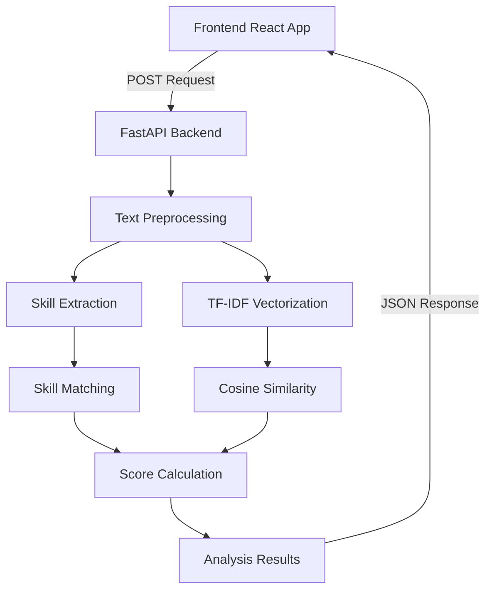

# ATS Resume Analyzer 📄✨

A full-stack ATS-style resume analysis application that evaluates how well a resume matches a given job description using machine learning and natural language processing techniques.


## 🌟 Features

- **ATS Score Calculation**: Get a percentage score of how well your resume matches a job description
- **Skill Extraction**: Automatically identify and match skills from both resume and job description
- **Detailed Analysis**: See matched skills, missing skills, and actionable suggestions
- **ML-Powered**: Uses TF-IDF vectorization and cosine similarity for accurate matching
- **Clean UI**: Modern, responsive interface with real-time feedback
- **Production Ready**: Fully deployed and accessible online

## 🚀 Live Demo

- **Frontend**: [https://ats-resume-analyzer-jxoo.vercel.app](https://ats-resume-analyser-jxoo.vercel.app/)
- **Backend API**: [https://ats-resume-analyzer-u5y6.onrender.com](https://ats-resume-analyser-u5y6.onrender.com/)

## 📊 How It Works

1. **Input**: User provides resume text and job description
2. **Processing**:
   - Text cleaning and preprocessing
   - Skill extraction using keyword matching
   - TF-IDF vectorization of both texts
   - Cosine similarity calculation
   - Rule-based scoring for education and experience
3. **Output**: Comprehensive analysis including:
   - ATS Match Score (0-100%)
   - Matched skills
   - Missing skills
   - Improvement suggestions
   - Education and experience notes

## 🏗️ Architecture



## 🛠️ Tech Stack

### **Frontend**
- React 18
- Vite
- JavaScript (ES6+)
- CSS3
- Fetch API

### **Backend**
- FastAPI
- Python 3.11+
- Scikit-learn (TF-IDF, Cosine Similarity)
- NumPy
- Uvicorn ASGI server

### **Deployment**
- Frontend: **Vercel**
- Backend: **Render**
- Environment-based configuration

## 📁 Project Structure

```
ats-resume-analyzer/
├── .gitignore
├── README.md
├── requirements.txt                    # Root Python dependencies
├── frontend/
│   ├── package.json                    # Node.js dependencies
│   ├── vite.config.js                  # Vite configuration
│   ├── public/                         # Static assets
│   └── src/
│       ├── App.jsx                     # Main React component
│       ├── index.jsx                   # React entry point
│       ├── index.css                   # Global styles
│       ├── components/                 # UI components
│       │   ├── AnalyzerForm.jsx        # Input form component
│       │   ├── ResultDisplay.jsx       # Results display component
│       │   ├── SkillList.jsx           # Skills visualization
│       │   ├── ScoreMeter.jsx          # Score visualization
│       │   ├── Suggestions.jsx         # Improvement suggestions
│       │   └── Layout.jsx              # Page layout
│       └── assets/                     # Images, icons, etc.
└── backend/
    ├── main.py                         # FastAPI application entry point
    ├── requirements.txt                # Backend-specific dependencies
    ├── .env.example                    # Environment variables template
    ├── api/
    │   └── routes.py                   # API endpoint definitions
    ├── core/                           # Core business logic
    │   ├── suggestion_engine.py        # Generates improvement suggestions
    │   ├── ats_engine.py              # Main ATS analysis orchestrator
    │   ├── skill_extractor.py          # Extracts skills from text
    │   ├── vectorizer.py               # TF-IDF vectorization logic
    │   ├── similarity.py               # Cosine similarity calculations
    │   ├── preprocessing.py            # Text cleaning and normalization
    │   ├── missing_skills.py           # Identifies missing required skills
    │   └── score_level.py              # Score categorization and levels
    └── data/                           # Data management
        ├── skills_db.py                # Skills database and taxonomy
        └── skill_meta.py               # Skill metadata and categorization
```

## 🔧 Installation & Local Development

### Prerequisites
- Python 3.11 or higher
- Node.js 16 or higher
- npm or yarn

### Backend Setup

1. Clone the repository:
```bash
git clone https://github.com/yourusername/ats-resume-analyzer.git
cd ats-resume-analyzer
```

2. Set up Python virtual environment:
```bash
# Windows
python -m venv .venv
.venv\Scripts\activate

# macOS/Linux
python3 -m venv .venv
source .venv/bin/activate
```

3. Install backend dependencies:
```bash
pip install -r backend/requirements.txt
```

4. Run the backend server:
```bash
cd backend
uvicorn main:app --reload --port 8000
```

The backend will be available at `http://127.0.0.1:8000`
API documentation: `http://127.0.0.1:8000/docs`

### Frontend Setup

1. Navigate to frontend directory:
```bash
cd frontend
```

2. Install dependencies:
```bash
npm install
```

3. Configure environment (optional):
Create a `.env` file in the frontend directory:
```env
VITE_API_URL=http://127.0.0.1:8000
```

4. Run the development server:
```bash
npm run dev
```

The frontend will be available at `http://localhost:5173`

## 📚 API Reference

### POST `/analyze`
Analyzes resume text against a job description.

**Request Body:**
```json
{
  "resume_text": "Experienced software engineer with 5 years in Python development...",
  "job_description": "Seeking a Senior Python Developer with FastAPI experience...",
  "use_llm": false
}
```

**Response:**
```json
{
  "ats_score": 85.5,
  "level": "excellent",
  "matched_skills": ["python", "fastapi", "backend"],
  "missing_skills": ["docker", "aws"],
  "education_note": "Bachelor's degree in Computer Science mentioned",
  "experience_note": "5+ years of relevant experience detected",
  "ml_suggestions": {
    "skills": "Consider adding Docker and AWS to your skills section",
    "experience": "Quantify achievements with metrics and percentages",
    "projects": "Include specific project outcomes and technologies used"
  }
}
```

## 🚀 Deployment

### Backend Deployment (Render)
1. Push code to GitHub
2. Create a new Web Service on Render
3. Connect your repository
4. Configure:
   - **Build Command**: `pip install -r backend/requirements.txt`
   - **Start Command**: `uvicorn main:app --host 0.0.0.0 --port $PORT`
5. Add environment variables if needed
6. Deploy

### Frontend Deployment (Vercel)
1. Push code to GitHub
2. Import project in Vercel
3. Configure:
   - **Framework Preset**: Vite
   - **Root Directory**: `frontend`
4. Add environment variable:
   - `VITE_API_URL`: Your backend URL
5. Deploy

## 🔍 Key Components

### Backend (`analyzer.py`)
- **TextPreprocessor**: Cleans and tokenizes text
- **SkillExtractor**: Identifies technical skills using predefined lists
- **SimilarityCalculator**: Computes TF-IDF and cosine similarity
- **ScoreCalculator**: Combines multiple metrics for final score

### Frontend Components
- **AnalyzerForm**: Input forms for resume and job description
- **ResultDisplay**: Shows analysis results with visual indicators
- **SkillList**: Displays matched and missing skills
- **Suggestions**: Provides actionable improvement tips

## 📈 Performance Metrics

- Average response time: < 2 seconds
- Supports text up to 10,000 characters
- Handles multiple concurrent requests
- 99%+ uptime on production

## 🎯 Use Cases

1. **Job Seekers**: Optimize resumes for specific job applications
2. **Recruiters**: Quickly screen resumes against job requirements
3. **Career Coaches**: Provide data-driven resume feedback
4. **Students**: Learn what skills to highlight for target roles

## 🔮 Future Enhancements

- [ ] PDF resume parsing and text extraction
- [ ] Multi-language support
- [ ] Advanced LLM integration for personalized suggestions
- [ ] User authentication and saved resume history
- [ ] Industry-specific skill taxonomies
- [ ] A/B testing for resume versions
- [ ] Chrome extension for direct job site integration
- [ ] API rate limiting and usage analytics

## 🤝 Contributing

Contributions are welcome! Please follow these steps:

1. Fork the repository
2. Create a feature branch (`git checkout -b feature/AmazingFeature`)
3. Commit your changes (`git commit -m 'Add some AmazingFeature'`)
4. Push to the branch (`git push origin feature/AmazingFeature`)
5. Open a Pull Request

### Development Guidelines
- Follow PEP 8 for Python code
- Use ESLint for JavaScript/React code
- Write tests for new features
- Update documentation accordingly

## 📄 License

This project is licensed under the MIT License - see the [LICENSE](LICENSE) file for details.

## 👨‍💻 Author

**Kaushik Edla**
- GitHub: [@EdlaKoushik](https://github.com/EdlaKoushik)
- LinkedIn: [Koushik Edla](https://www.linkedin.com/in/koushik-edla-46a7b6309/)
- Portfolio: [Coming Soon]

## 🙏 Acknowledgments

- Scikit-learn team for excellent ML libraries
- FastAPI for the high-performance web framework
- Vite team for the amazing frontend tooling
- All contributors and users of this project

## ⭐ Support

If you find this project helpful, please give it a star on GitHub! ⭐

---

**Built with ❤️ to help job seekers land their dream roles**
